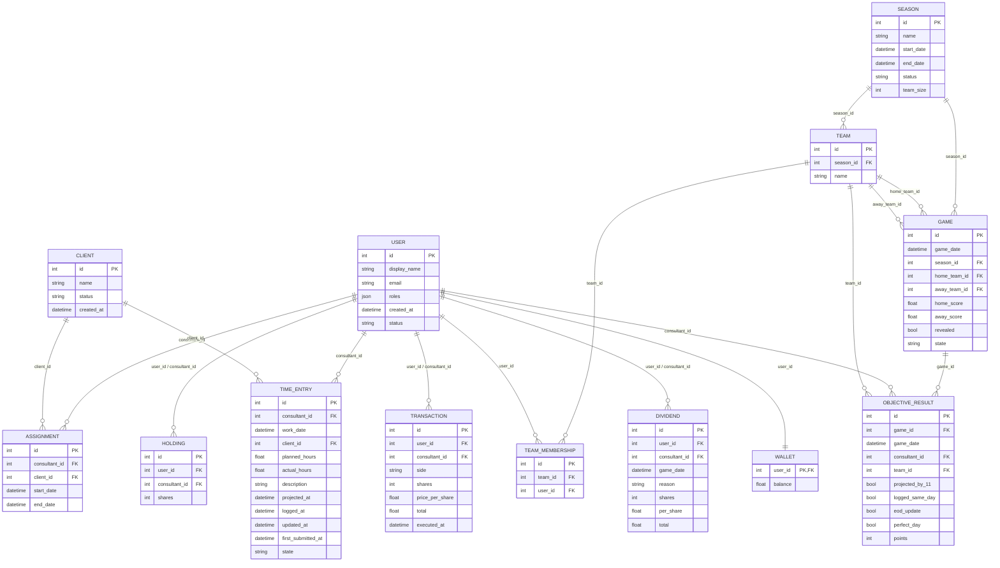

# Entity-Relationship Diagram

Reflects the SQLAlchemy models in `app/models.py`, which implement the domain
data model in `backlog/docs/doc-1 - Fantasy-Timesheets-—-Product-Technical-Spec.md`
Section 4. Update this diagram whenever a model's fields or relationships
change.

## Deliberate deviations from the spec's literal field list

- **TeamMembership** is a new join table, not in the spec's entity list. `Team.memberIds[]` is normalized into it so membership is foreign-key-enforced against `users`, per AC #4.
- **ObjectiveResult.game_id** is a new FK column, not in the spec's field list for this entity (which only lists `gameDate`). Added so the row is foreign-key-enforced against a real `Game`; `game_date` is kept alongside it since the spec names it explicitly and it avoids a join for date-range queries.
- **Wallet** uses `user_id` as its primary key (no separate `id` column), matching the spec's field list of `(userId, balance)` — the only entity without a synthetic autoincrement id.
